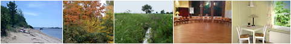

# Der Vorstand verweist auf die aktuellen Corona-Verordnungen der jeweiligen Bundesländer:

Derzeit ändern sich die politischen Verordnungen zu den Lockerungen in den verschiedenen Bundesländern in deutlich unterschiedlichem Tempo und auch nicht immer unter der genauen terminlichen Einhaltung des ursprünglich vorgesehenen Stufenplans.

Deshalb sind die Anbieter und Teilnehmer von A-Veranstaltungen, welche nicht vom Selbsthilfe-Freizeitwerk e.V. selber durchgeführt werden, verpflichtet, sich über die jeweils aktuellen Vorgaben und Verordnungen des betreffenden Bundeslandes selbst zu informieren und danach zu handeln.

Für die Inhalte der jeweiligen Ausschreibung können wir keine Verantwortung übernehmen und verweisen auf die Informationspflicht zur jeweils aktuellen Verordnung.

# Veranstaltungen, die dem A-Programm nahe stehen
---
Hier findet Ihr Veranstaltungen, die keine A-Freizeiten sind, aber von denen
wir glauben, dass sie Euch interessieren könnten. Bitte teilt uns Termine und
Veranstaltungen mit, die in diese Kategorie passen.

### Kuschelmeeting Bonn (für alle A-Gruppen-Angehörigen)

Jeden 1. und 3. Freitag im Monat findet von 19.30 bis 21.30 Uhr (Einlass ab 19:15 Uhr) 
das K-Meeting in Bonn-Beuel, Neu-Vilich statt.

Kontakt / Auskunft über Raimund, Tel.: 02241-319386

### Kuschelmeeting Remscheid

Jeden 2. Und 4. Freitag um 19.30 Uhr!
Für Anmeldung und weitere Infos bitte Mo-Fr 16h oder 18h unter folgender Nummer anrufen,
Oliver 01604371917

### Kuschelmeeting
für Frauen, jeden ersten Donnerstag im Monat
im Schloss Glarisegg am Bodensee, Nähe Konstanz, 19:30-21:00
Spendenbasis

Infos unter 01782090444 (Monika)

### Kuschelmeeting Karlsruhe (offen für alle A-Gruppen-Angehörigen)

> Kuschelmeeting 1 - 2 x pro Monat in Karlsruhe für alle A-Gruppen-Angehörigen und Ehemalige der 12-Schritte-Kliniken. 
> Interessenten melden sich bzgl. näherer Infos bitte bei mir. 
> Freue mich sehr über Nachricht. <umhanni@icloud.com>

-----------------------------------------------------------------------------------

## Treffen von 12-Schritte Gruppen

bitte bekanntgeben - <webmaster@a-freizeiten.de>

## Treffen für Ehemalige aus 12-Schritte Kliniken / Minifreizeiten

### Peter lädt ein zu Mini-Freizeiten in MINDEN 

### Es gibt eine Info von Peter zu künftigen Mini-Freizeiten in Minden unter dem Menüpunkt "Aktuelles"

------------------------------------------------------------------------------

MINIFREIZEIT IN BLUMENTHAL

'07. - 09. August 2020

Wochenende für Ehemalige aus 12-Schritte-Kliniken
und A-Freundinnen und A-Freunde

Claudia und Mechtild laden ein

[Mini-Freizeit Bremen.pdf](pdf/Mini-Freizeit 2020 Bremen.pdf)

[Anmeldung.pdf](pdf/Anmeldung Mini 2020.pdf)

--------------------------------------------------------------------------------

### Inventur-Wochenende, Tagesmeetings und Jahreswechsel für Weggefährten aus allen A-Gruppen

Mit den 12 Schritten durchs Jahr mit Ruth, Brigitte, Christa und Christoph 

<http://www.12schrittewochenende.de>

### TA ME SE RE BE Gruppen/Meetings: Tanzen, Menschen, Selbsthilfe, Reden, Bewegung

Jeden Mittwoch, 19:15 Uhr, Falkenklause, 87730 Bad Grönenbach/Ittelsburg, Falkenweg 4.

__Veranstalter:__

Andreas Fischer (Ehemaliger),
Am Sonnenhang 13,
87496 Untrasried

<a.fischer@fischerskfzwerkstatt.de>

Tel: 0151 27237547
