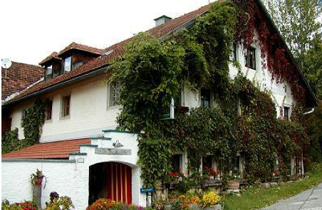

  <!-- Indicators -->
  <ol class="carousel-indicators">
    <li data-target="#myCarousel" data-slide-to="0" class="active"></li>
    <li data-target="#myCarousel" data-slide-to="1"></li>
    <li data-target="#myCarousel" data-slide-to="2"></li>
    <li data-target="#myCarousel" data-slide-to="3"></li>
  </ol>

  <!-- Wrapper for slides -->
  

    

      
      

        Bayrischer Wald 2000
      

    

    

      
      

        Reit im Winkl 2011
      

    

    

      
      

        Solling 2011
      

    

    

      
      

        Wiedhölzlkaser 2014
      

    

  

  <!-- Left and right controls -->
  <a class="left carousel-control" href="#myCarousel" role="button" data-slide="prev">
    
    Previous
  </a>
  <a class="right carousel-control" href="#myCarousel" role="button" data-slide="next">
    
    Next
  </a>

  

    <h3 class="panel-title">A-Freizeiten - Was sind das?</h3>
  

  

Freizeiten sind Selbsthilfeveranstaltungen, bei denen die Teilnehmer eine Art
<b>Lebensgemeinschaft auf Zeit</b> bilden.
Sie werden im <b>Stil des A-Programms der Anonymen Alkoholiker</b> ausgetragen, das
auch viele andere Selbsthilfegruppen für sich adaptiert haben.
   

## Wer kann teilnehmen?

Freizeiten sind Veranstaltungen für __Mitglieder von Zwölf-Schritte-Gruppen__,
die mit dem Zwölf-Schritte-Programm nach dem Vorbild der Anonymen Alkoholiker
arbeiten. Deren __Angehörige__ dürfen in der Regel. ebenfalls teilnehmen.
Manche Veranstaltungen sind auch für Nichtmitglieder offen, wenn diese dem
A-Programm nahe stehen.

Der __Ablauf__ der Freizeit, das __Freizeitprogramm__, wird von den Teilnehmern
__selbst organisiert und gestaltet__.
Durch die Angebote der Freizeitteilnehmer sind dann
Meetings zu allen möglichen Themen, Meditationen, Trommeln, Tanzen, Singen,
Musizieren, Massage, Spiele, Kuscheln, Spaziergänge und Wanderungen, Ausflüge,
Märchenstunde, Lagerfeuer und vieles mehr möglich. Der Bunte Abend, der
natürlich auch von den Freizeitteilnehmern selbst gestaltet wird, bildet auf
fast allen Freizeiten einen der Höhepunkte.

Auf Freizeiten gibt es eine Möglichkeit, __Geborgenheit und Wärme__ zu spüren.
Wärme und Nähe sind Grundbedürfnisse des Menschen. Man kann dadurch die eigenen
Gefühle kennenlernen, ein Stück Urvertrauen wiedererleben, die Gefühle und die
Seele heilen, Wohlbefinden spüren und Erholung tanken.
__Es geht um respektvollen, liebevollen und einfühlsamen Umgang mit den eigenen
und den Grenzen anderer.__

Freizeiten sind in der Regel __alkohol- und weitgehend rauchfrei__. Die
Unterbringung erfolgt vorwiegend in Mehrbettzimmern.
Einzel- und Doppelzimmer stehen im
Allgemeinen nur in geringem Umfang zur Verfügung. Auf den meisten Freizeiten
ist eine Mithilfe beim Küchendienst erforderlich. Vor der Abreise wird das
Haus gemeinsam gereinigt.

Manche Freizeiten finanzieren sich ausschließlich auf Selbstkostenbasis, bei
anderen behält der Veranstalter einen kleinen Kostenanteil für sich ein.
__Die Veranstalter von A-Freizeiten verfolgen jedoch eindeutig keine finanziellen
Ziele.__

Der Preis bezieht sich grundsätzlich auf Vollpension, wenn es nicht ausdrücklich
anders angegeben ist. Vegetarisches Essen stellt kein Problem dar, speziellere
Anforderungen müssen aber vor der Anmeldung mit der Freizeitleitung geklärt
werden.
__Jeder ist für sich selbst und die Gemeinschaft verantwortlich.__
